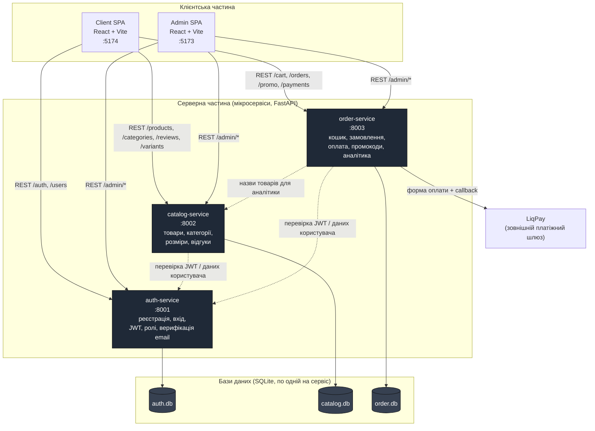

# Архітектура системи (діаграма розгортання / компонентів)

Мікросервісна архітектура: 3 незалежні backend-сервіси (FastAPI), 2 SPA-фронтенди
(React), кожен сервіс має власну базу даних SQLite. Міжсервісна взаємодія —
через HTTP (REST), автентифікація — спільний JWT (HS256).

## Технологічний стек

| Шар | Технології |
|-----|-----------|
| Backend | Python 3.11+, FastAPI, SQLAlchemy 2.0, Pydantic v2, Uvicorn |
| БД | SQLite (по одній на мікросервіс) |
| Автентифікація | JWT (HS256, python-jose), bcrypt |
| Frontend | React 19, TypeScript, Vite, Tailwind CSS, Axios, Recharts |
| Оплата | LiqPay (sandbox) |
| Розгортання | Docker, docker-compose, Kubernetes, GitHub Actions CI/CD |
| Тестування | pytest, pytest-cov (193 тести, покриття 69–94%) |
