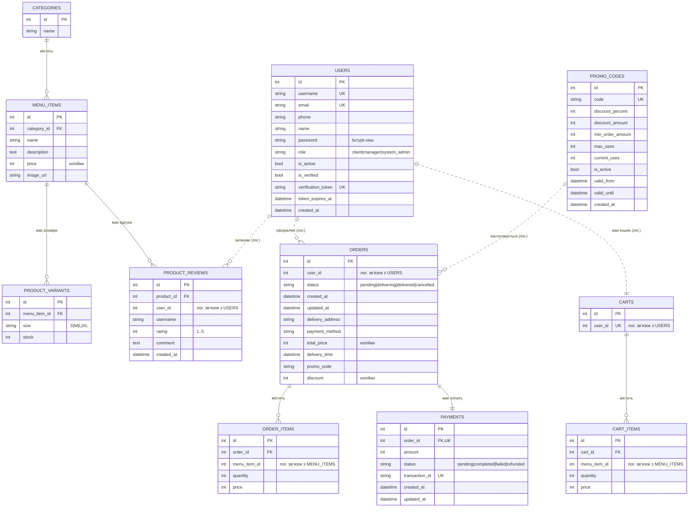

# ER-діаграма (схема баз даних)

Кожен мікросервіс має власну базу. Зв'язки між сервісами — логічні (через
`user_id`, `menu_item_id`), фізичних зовнішніх ключів між базами немає
(особливість мікросервісної архітектури — database-per-service).

**Примітка.** Пунктирні зв'язки (`..`) — логічні (cross-service): сутності
знаходяться в різних базах даних різних мікросервісів і пов'язані лише
ідентифікаторами, без фізичних FOREIGN KEY. Суцільні (`--`) — фізичні зовнішні
ключі в межах однієї бази.

Грошові суми зберігаються в копійках (ціле число) для уникнення похибок
обчислень із плаваючою комою.
