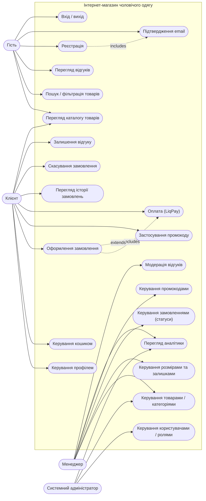

# Діаграма прецедентів (Use Case)

Актори системи: **Гість** (неавтентифікований), **Клієнт**, **Менеджер**,
**Системний адміністратор**. Ролі ієрархічні: системний адміністратор
успадковує можливості менеджера, менеджер — клієнта.

**include**: оформлення замовлення обов'язково включає оплату; реєстрація
включає підтвердження email. **extend**: застосування промокоду — необов'язкове
розширення сценарію оформлення замовлення.
