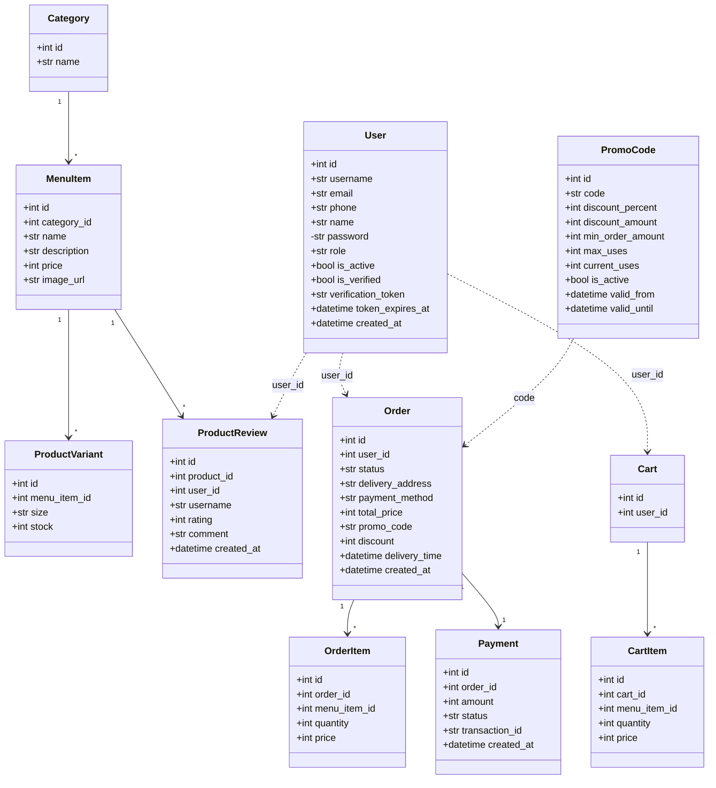

# Діаграма класів (доменна модель)

Класи моделей предметної області (SQLAlchemy ORM), згруповані за мікросервісами.

Згруповано: `User` — auth-service; `Category`, `MenuItem`, `ProductVariant`,
`ProductReview` — catalog-service; `Cart`, `CartItem`, `Order`, `OrderItem`,
`Payment`, `PromoCode` — order-service.
