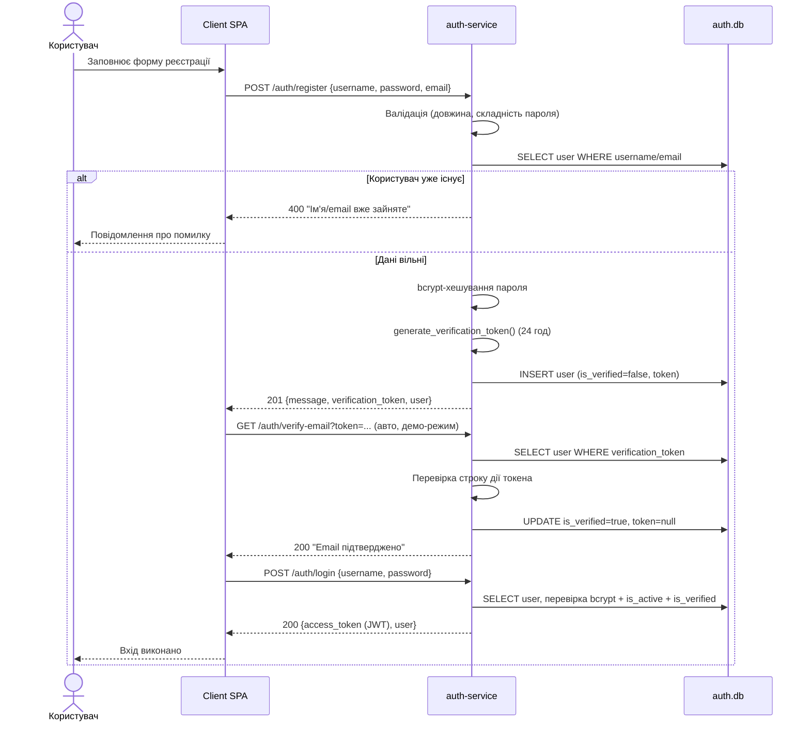

# Діаграма послідовності: реєстрація та підтвердження email

У промисловому режимі крок підтвердження виконується користувачем за
посиланням з листа (SMTP). Для демонстраційного/дипломного режиму, де SMTP не
налаштовано, токен повертається у відповіді й підтвердження виконується
автоматично, зберігаючи повний серверний механізм верифікації.
