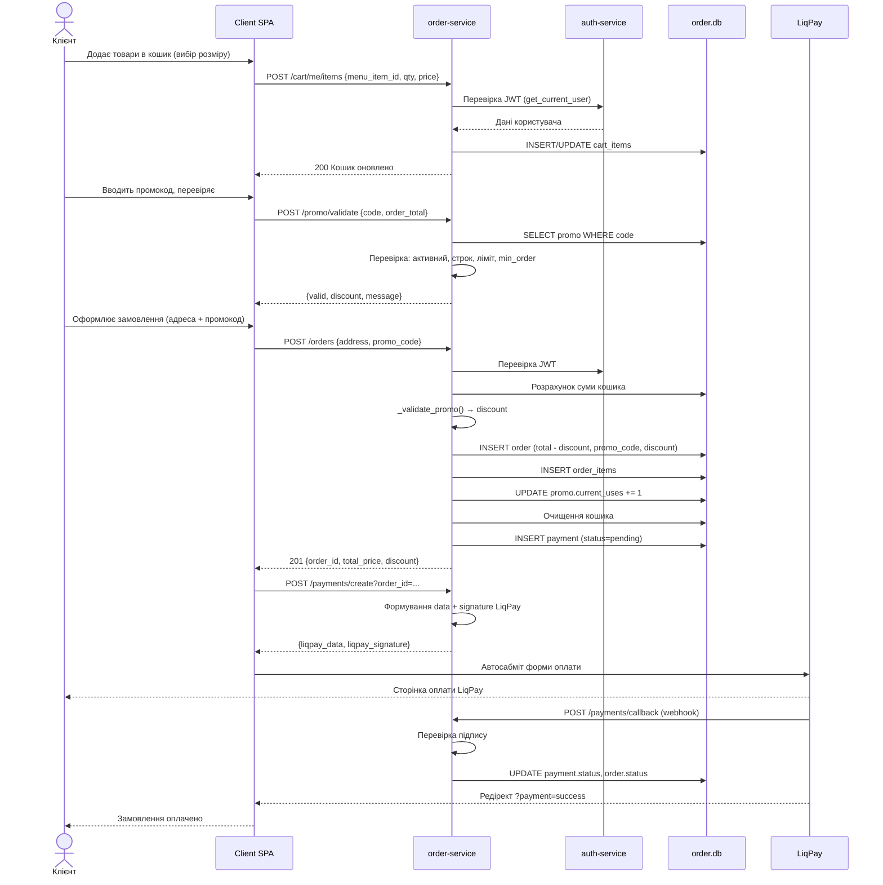

# Діаграма послідовності: оформлення замовлення з промокодом та оплатою

```mermaid
sequenceDiagram
    actor U as Клієнт
    participant FE as Client SPA
    participant ORD as order-service
    participant AUTH as auth-service
    participant DB as order.db
    participant LP as LiqPay

    U->>FE: Додає товари в кошик (вибір розміру)
    FE->>ORD: POST /cart/me/items {menu_item_id, qty, price}
    ORD->>AUTH: Перевірка JWT (get_current_user)
    AUTH-->>ORD: Дані користувача
    ORD->>DB: INSERT/UPDATE cart_items
    ORD-->>FE: 200 Кошик оновлено

    U->>FE: Вводить промокод, перевіряє
    FE->>ORD: POST /promo/validate {code, order_total}
    ORD->>DB: SELECT promo WHERE code
    ORD->>ORD: Перевірка: активний, строк, ліміт, min_order
    ORD-->>FE: {valid, discount, message}

    U->>FE: Оформлює замовлення (адреса + промокод)
    FE->>ORD: POST /orders {address, promo_code}
    ORD->>AUTH: Перевірка JWT
    ORD->>DB: Розрахунок суми кошика
    ORD->>ORD: _validate_promo() → discount
    ORD->>DB: INSERT order (total - discount, promo_code, discount)
    ORD->>DB: INSERT order_items
    ORD->>DB: UPDATE promo.current_uses += 1
    ORD->>DB: Очищення кошика
    ORD->>DB: INSERT payment (status=pending)
    ORD-->>FE: 201 {order_id, total_price, discount}

    FE->>ORD: POST /payments/create?order_id=...
    ORD->>ORD: Формування data + signature LiqPay
    ORD-->>FE: {liqpay_data, liqpay_signature}
    FE->>LP: Автосабміт форми оплати
    LP-->>U: Сторінка оплати LiqPay
    LP->>ORD: POST /payments/callback (webhook)
    ORD->>ORD: Перевірка підпису
    ORD->>DB: UPDATE payment.status, order.status
    LP-->>FE: Редірект ?payment=success
    FE-->>U: Замовлення оплачено
```
