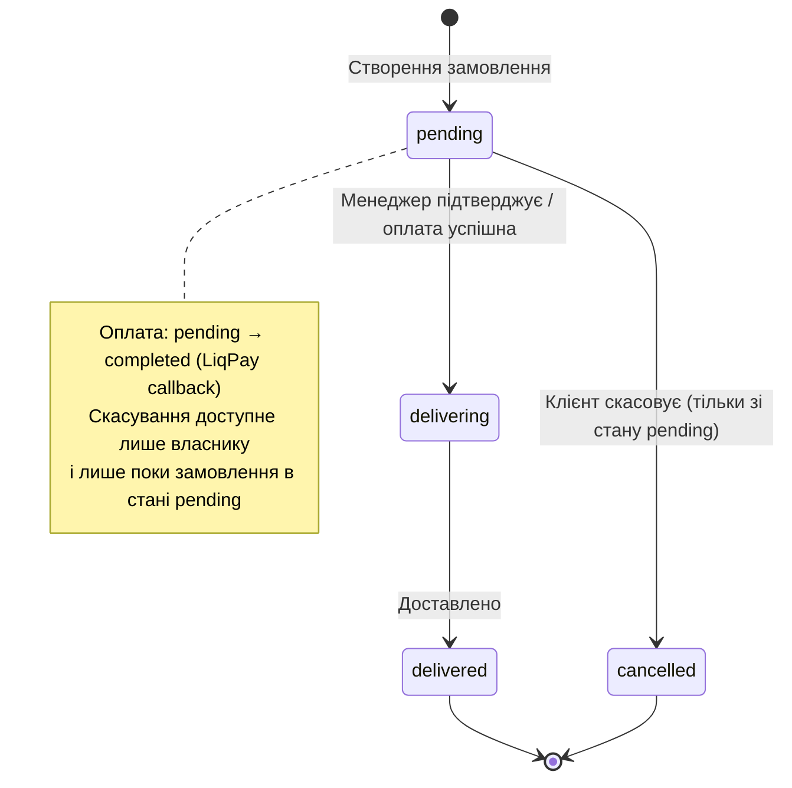

# Діаграма станів: життєвий цикл замовлення

Статуси оплати (Payment.status): `pending` → `completed` | `failed` |
`refunded`. Статус оплати оновлюється асинхронно через webhook LiqPay
(`POST /payments/callback`).
